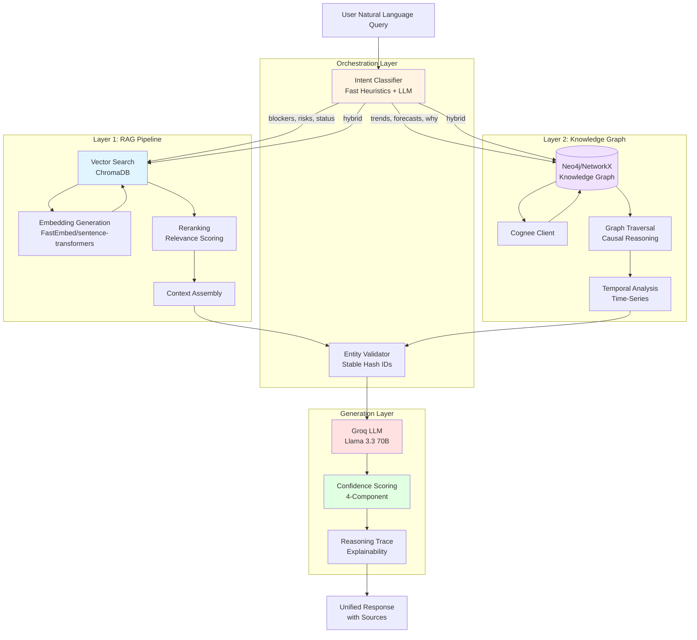
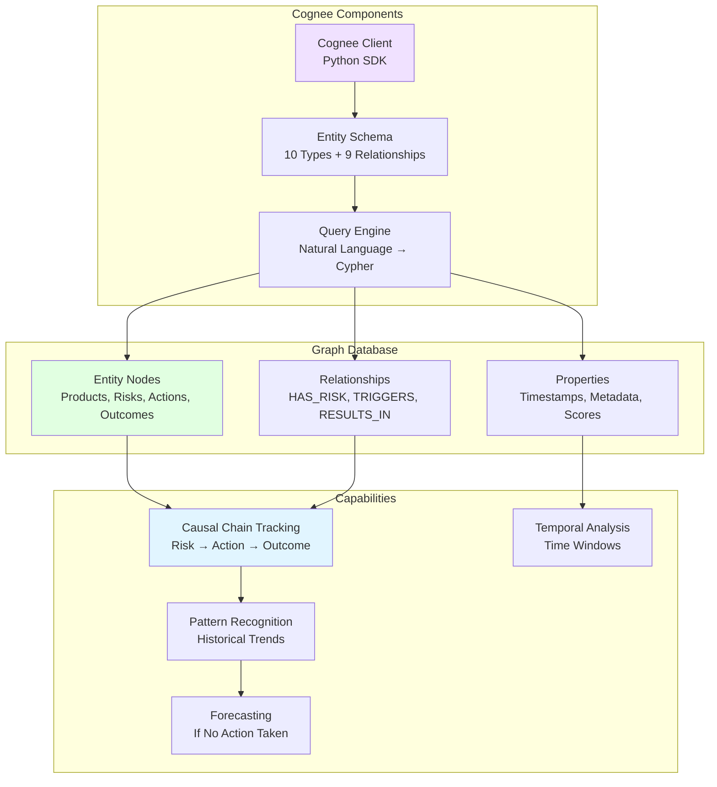
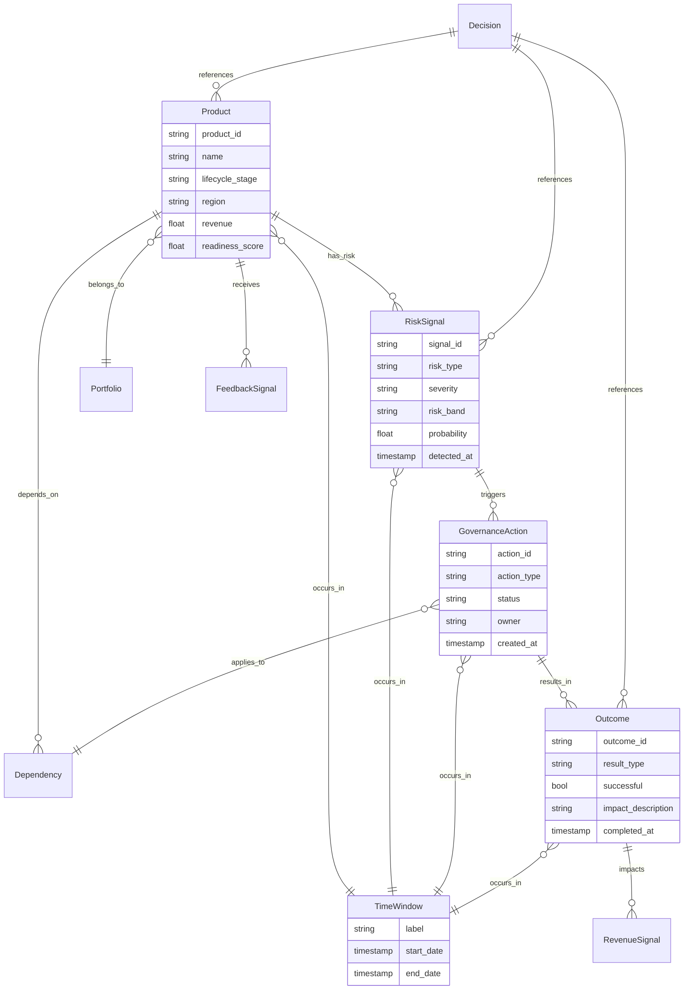
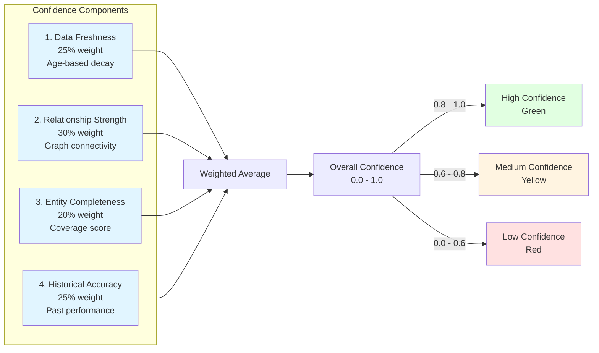
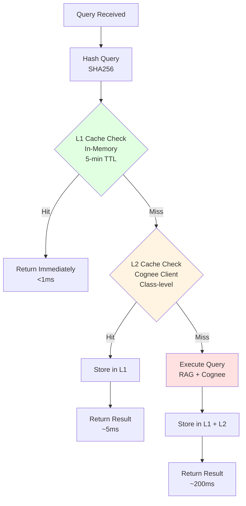

# AI Architecture - Dual-Layer Intelligence System

## Overview

Studio Pilot Vision implements a sophisticated **dual-layer AI architecture** that combines fast retrieval with deep reasoning capabilities.

## High-Level AI System Architecture



## Layer 1: RAG Pipeline

### Purpose
Fast retrieval of relevant information from documents and structured data.

### Components

#### 1. Embedding Generation
**Model:** FastEmbed with BAAI/bge-small-en-v1.5
- **Dimensions:** 384
- **Latency:** 10-50ms (local inference)
- **Cost:** $0 (runs locally)

**Why FastEmbed?**
- 5-10x faster than OpenAI embeddings
- No API call latency
- Consistent performance
- Good quality for domain-specific text

```python
from fastembed import TextEmbedding

embedding_model = TextEmbedding("BAAI/bge-small-en-v1.5")
embeddings = embedding_model.embed(["query text"])
```

#### 2. Vector Store (ChromaDB)
**Purpose:** Semantic search over product documents, governance actions, Jira data

**Collections:**
- `product_documents` - Product descriptions, specs, requirements
- `governance_documents` - Escalations, decisions, outcomes
- `jira_documents` - Work items, blockers, progress

**Configuration:**
```python
CHROMA_SETTINGS = {
    "anonymized_telemetry": False,
    "allow_reset": True,
    "is_persistent": True
}
```

**Query Pattern:**
```python
results = collection.query(
    query_embeddings=[query_embedding],
    n_results=10,
    where={"product_id": product_id}  # Optional filtering
)
```

#### 3. Reranking
**Purpose:** Improve relevance by reordering retrieved chunks

**Strategy:**
- Semantic similarity score
- Metadata relevance (product_id match, recency)
- Chunk completeness score

#### 4. Context Assembly
**Purpose:** Build optimal context for LLM generation

**Process:**
1. Retrieve top-k chunks (k=10)
2. Rerank by relevance
3. Take top-n (n=5)
4. Add metadata (source, timestamp, confidence)
5. Format for LLM prompt

**Context Window Management:**
- Max context: 8K tokens (safe for Llama 3.3 70B)
- Reserved for response: 2K tokens
- Chunk size: ~500 tokens each

### Performance Characteristics
- **Retrieval:** ~50-100ms
- **Embedding:** ~10-20ms
- **Reranking:** ~5-10ms
- **Total:** ~100ms

---

## Layer 2: Cognee Knowledge Graph

### Purpose
Persistent memory, causal reasoning, temporal analysis, and explainable AI.

### Architecture



### Entity Schema (10 Types)



### Query Patterns

#### 1. Causal Chain Tracking
**Question:** "Why did Product X get escalated?"

**Graph Query:**
```cypher
MATCH path = (p:Product {product_id: $id})-[:HAS_RISK]->(r:RiskSignal)
             -[:TRIGGERS]->(a:GovernanceAction)
             -[:RESULTS_IN]->(o:Outcome)
WHERE r.detected_at > $start_date
RETURN path, r.severity, a.action_type, o.successful
ORDER BY r.detected_at DESC
```

**Response:**
```json
{
  "causal_chain": [
    {"entity": "RiskSignal", "type": "Yellow Risk Detected", "timestamp": "2025-01-01"},
    {"entity": "GovernanceAction", "type": "Escalation to VP", "timestamp": "2025-01-02"},
    {"entity": "Outcome", "type": "Additional Resources Allocated", "timestamp": "2025-01-05"}
  ],
  "reasoning": "Product X was escalated because readiness score dropped to 65%, triggering a yellow risk signal on Jan 1st. This was escalated to VP on Jan 2nd, resulting in additional resources allocated on Jan 5th."
}
```

#### 2. Temporal Analysis
**Question:** "How has Product X's risk profile changed over time?"

**Graph Query:**
```cypher
MATCH (p:Product {product_id: $id})-[:HAS_RISK]->(r:RiskSignal)
      -[:OCCURS_IN]->(tw:TimeWindow)
RETURN tw.label, r.risk_band, r.severity, count(r) as risk_count
ORDER BY tw.start_date ASC
```

**Visualization:**
```
Q4 2024 Week 1: Green (2 risks)
Q4 2024 Week 2: Green (1 risk)
Q4 2024 Week 3: Yellow (3 risks)
Q4 2024 Week 4: Yellow (4 risks)
Q1 2025 Week 1: Red (5 risks) ← Current
```

#### 3. Pattern Recognition
**Question:** "What actions were most effective for reducing Red risks?"

**Graph Query:**
```cypher
MATCH (r:RiskSignal {risk_band: 'Red'})-[:TRIGGERS]->(a:GovernanceAction)
      -[:RESULTS_IN]->(o:Outcome {successful: true})
RETURN a.action_type, count(o) as success_count, avg(o.impact_score) as avg_impact
ORDER BY success_count DESC, avg_impact DESC
LIMIT 5
```

**Results:**
```
1. "Executive Escalation" → 15 successes, 0.85 avg impact
2. "Additional Resources" → 12 successes, 0.78 avg impact
3. "Scope Reduction" → 8 successes, 0.65 avg impact
```

#### 4. Forecasting
**Question:** "What happens if we don't act on this risk?"

**Graph Query:**
```cypher
MATCH (r:RiskSignal {severity: $current_severity})-[:SIMILAR_TO*1..3]->(historical:RiskSignal)
WHERE NOT exists((historical)-[:TRIGGERS]->(:GovernanceAction))
MATCH (historical)-[:RESULTS_IN]->(bad_outcome:Outcome {successful: false})
RETURN historical, bad_outcome, count(*) as occurrence_count
```

**Forecast:**
```
Based on 8 similar historical cases where no action was taken:
- 75% escalated to next risk band within 2 weeks
- 50% resulted in schedule delays (avg 3 weeks)
- 25% led to scope reductions

Recommended action: Escalate to VP within 48 hours
```

### Confidence Scoring (4-Component)



#### Calculation Details

**1. Data Freshness (25%):**
```python
def calculate_freshness(last_updated: datetime) -> float:
    age_hours = (now - last_updated).total_seconds() / 3600
    if age_hours < 24:
        return 1.0
    elif age_hours < 168:  # 1 week
        return 0.8
    elif age_hours < 720:  # 1 month
        return 0.6
    else:
        return 0.4
```

**2. Relationship Strength (30%):**
```python
def calculate_relationship_strength(entity_id: str) -> float:
    # Count connected entities
    connections = graph.get_connections(entity_id)

    # More connections = higher confidence
    if connections > 10:
        return 1.0
    elif connections > 5:
        return 0.8
    elif connections > 2:
        return 0.6
    else:
        return 0.4
```

**3. Entity Completeness (20%):**
```python
def calculate_completeness(entity: Entity) -> float:
    required_fields = ['id', 'name', 'type', 'timestamp']
    optional_fields = ['description', 'metadata', 'owner']

    required_score = sum([1 for f in required_fields if getattr(entity, f)]) / len(required_fields)
    optional_score = sum([1 for f in optional_fields if getattr(entity, f)]) / len(optional_fields)

    return 0.7 * required_score + 0.3 * optional_score
```

**4. Historical Accuracy (25%):**
```python
def calculate_historical_accuracy(query_type: str) -> float:
    # Track prediction accuracy over time
    past_queries = get_similar_queries(query_type, limit=10)

    correct_predictions = sum([q.was_accurate for q in past_queries])
    total_predictions = len(past_queries)

    if total_predictions == 0:
        return 0.7  # Default for new query types

    return correct_predictions / total_predictions
```

---

## Hybrid Query Strategy

### Intent Classification

```mermaid
graph TD
    Query[User Query]

    Query --> Fast{Fast Heuristics<br/>Keyword Matching}

    Fast -->|"blockers", "status"| RAG[RAG Only]
    Fast -->|"why", "trends"| Graph[Cognee Only]
    Fast -->|"risks AND history"| Hybrid[Both Layers]
    Fast -->|Unclear| LLM[LLM Classification]

    LLM --> RAG
    LLM --> Graph
    LLM --> Hybrid

    RAG --> Merge[Response Merging]
    Graph --> Merge
    Hybrid --> Merge

    Merge --> Response[Unified Response]

    style Fast fill:#fff4e1
    style RAG fill:#e1f5ff
    style Graph fill:#f0e1ff
    style Hybrid fill:#e1ffe1
```

### Query Routing Rules

| Query Type | Intent | Route | Rationale |
|------------|--------|-------|-----------|
| "What blockers does Product X have?" | blockers | RAG | Fast retrieval, current state |
| "Why was Product X escalated?" | causal | Cognee | Needs causal chain reasoning |
| "Show me all Red risks" | status | RAG | Simple filtering, current state |
| "What's the trend for Product X?" | trends | Cognee | Needs temporal analysis |
| "What happens if we don't act?" | forecast | Cognee | Needs pattern recognition |
| "Tell me about Product X risks and history" | hybrid | Both | Needs current state + context |

### Response Merging Strategy

```python
def merge_responses(rag_result: RAGResult, cognee_result: CogneeResult) -> UnifiedResponse:
    """
    Merge responses from both layers
    """
    # Prioritize based on confidence
    primary_source = cognee_result if cognee_result.confidence > rag_result.confidence else rag_result
    secondary_source = rag_result if primary_source == cognee_result else cognee_result

    # Combine sources
    all_sources = primary_source.sources + secondary_source.sources

    # Use primary answer, augment with secondary context
    merged_answer = f"{primary_source.answer}\n\nAdditional context: {secondary_source.summary}"

    # Calculate combined confidence
    combined_confidence = 0.7 * primary_source.confidence + 0.3 * secondary_source.confidence

    return UnifiedResponse(
        answer=merged_answer,
        confidence=combined_confidence,
        sources=all_sources,
        source_type="hybrid"
    )
```

---

## LLM Generation Layer

### Model: Groq with Llama 3.3 70B

**Why Groq?**
- 5-10x faster inference than OpenAI
- Lower cost (~$0.50/M tokens vs $2/M tokens)
- Competitive quality with GPT-4
- Consistent performance

**Configuration:**
```python
LLM_CONFIG = {
    "provider": "custom",
    "model": "groq/llama-3.3-70b-versatile",
    "endpoint": "https://api.groq.com/openai/v1",
    "temperature": 0.1,  # Low for consistency
    "max_tokens": 2048,
    "top_p": 0.9
}
```

### Prompt Engineering

**System Prompt:**
```
You are an AI assistant for the Mastercard Studio Intelligence Platform.
You provide accurate, concise insights about product portfolios, risks, and governance actions.

Guidelines:
1. Always cite sources from the provided context
2. If information is uncertain, state the confidence level
3. For forecasts, explain the historical basis
4. Use specific numbers and dates when available
5. Keep responses focused and actionable

Response format:
- Direct answer first
- Supporting evidence second
- Recommended actions third
- Sources last
```

**User Prompt Template:**
```
Context from Vector Store:
{rag_context}

Context from Knowledge Graph:
{cognee_context}

User Question: {user_query}

Provide a comprehensive answer with:
1. Direct response to the question
2. Supporting evidence from context
3. Confidence level (High/Medium/Low) with reasoning
4. Recommended actions (if applicable)
5. List all sources used
```

---

## Performance Optimization

### Caching Strategy



### Lazy Loading

**Problem:** Cognee initialization takes ~500ms, increasing cold start time

**Solution:** Lazy load Cognee on first query
```python
class CogneeLazyLoader:
    _instance = None
    _client = None

    @classmethod
    def get_client(cls):
        if cls._client is None:
            cls._client = CogneeClient()
            cls._client.initialize()
        return cls._client
```

**Benefits:**
- Faster API startup
- Lower memory footprint for RAG-only queries
- Better resource utilization

### Batch Processing

**Ingestion Jobs:** Run asynchronously in background
```python
@app.post("/cognee/ingest/products")
async def ingest_products(background_tasks: BackgroundTasks):
    job_id = str(uuid.uuid4())
    background_tasks.add_task(run_ingestion, job_id, "products")
    return {"job_id": job_id, "status": "started"}
```

---

## Guardrails & Safety

### Answer Type Marking

```python
class AnswerType(Enum):
    GROUNDED = "grounded"       # Fully supported by data
    SPECULATIVE = "speculative" # Based on patterns, not direct data
    PARTIAL = "partial"         # Some information missing
    UNKNOWN = "unknown"         # Cannot answer confidently
```

### Quality Checks

1. **Source Attribution:** Every claim must reference a source
2. **Confidence Threshold:** Low confidence (< 0.6) triggers warning
3. **Hallucination Detection:** Cross-check answer against context
4. **Completeness Check:** Warn if query needs more context

### Example Guardrail Response

```json
{
  "answer": "Product X has 3 blockers: Partner API delay, internal resource constraint, security review pending",
  "confidence": 0.85,
  "guardrails": {
    "answer_type": "grounded",
    "warnings": [],
    "completeness": 0.9,
    "sources_cited": 3
  }
}
```

---

## Testing & Validation

### Unit Tests
- Intent classification accuracy: > 95%
- Entity validation: > 99%
- Confidence calculation: Matches expected values

### Integration Tests
- End-to-end query flow
- RAG + Cognee hybrid queries
- Error handling and fallbacks

### Performance Tests
- Latency under load (100 queries/min)
- Cache hit rate (target: > 60%)
- Memory usage (target: < 2GB)

### Quality Tests
- Answer accuracy (human evaluation)
- Source attribution (100% coverage)
- Confidence calibration (tracking over time)

---

## Related Documentation

- [System Architecture](./ARCHITECTURE.md)
- [Cognee Knowledge Graph](./COGNEE_KNOWLEDGE_GRAPH.md)
- [API Documentation](./API_DOCS.md)
- [Operational Runbook](./RUNBOOK.md)

---

**Last Updated:** 2026-01-04
**Version:** 1.0
