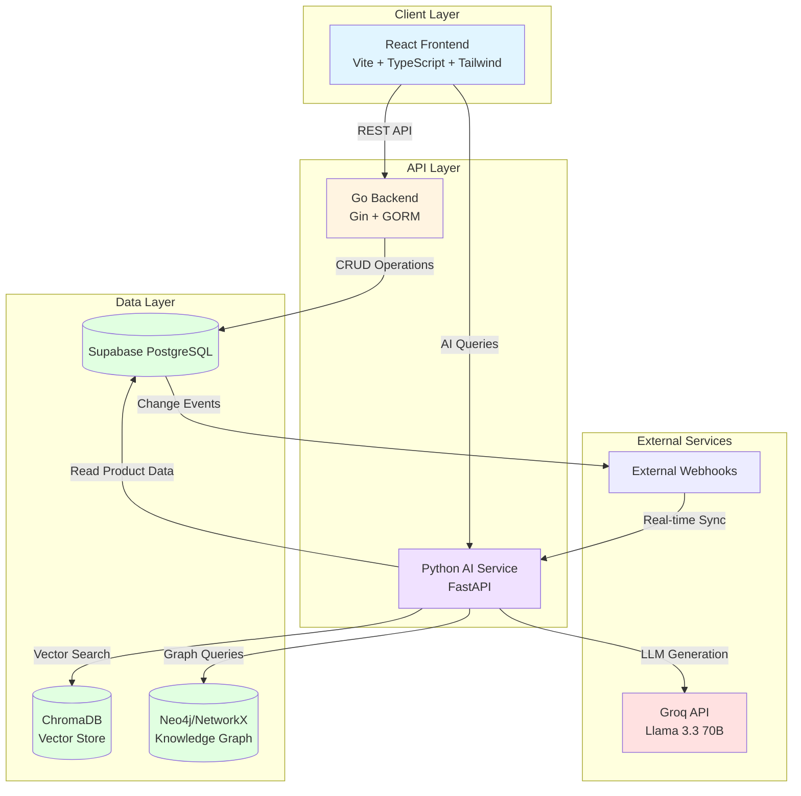
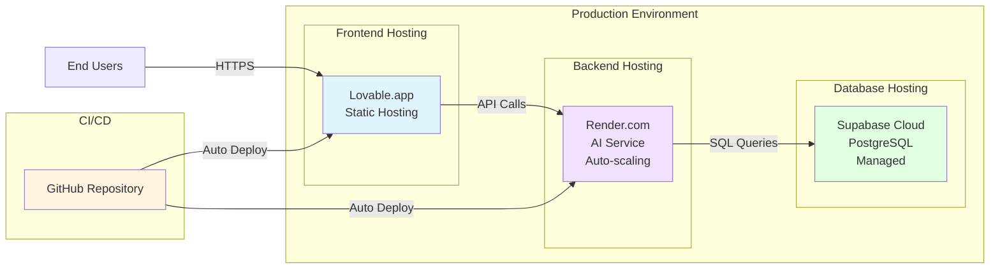
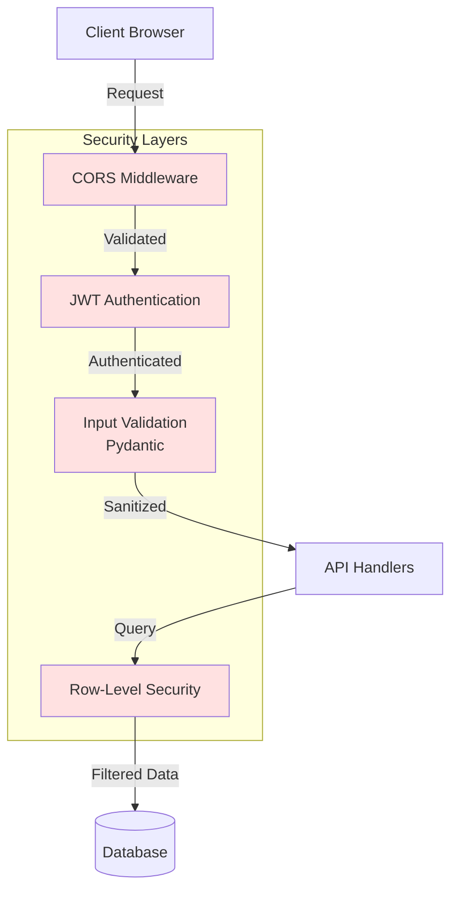
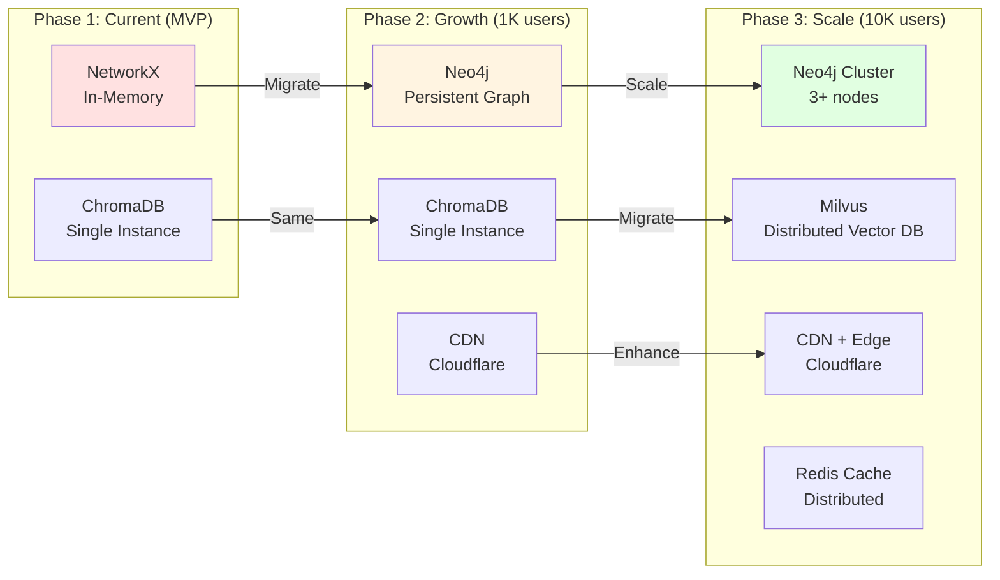
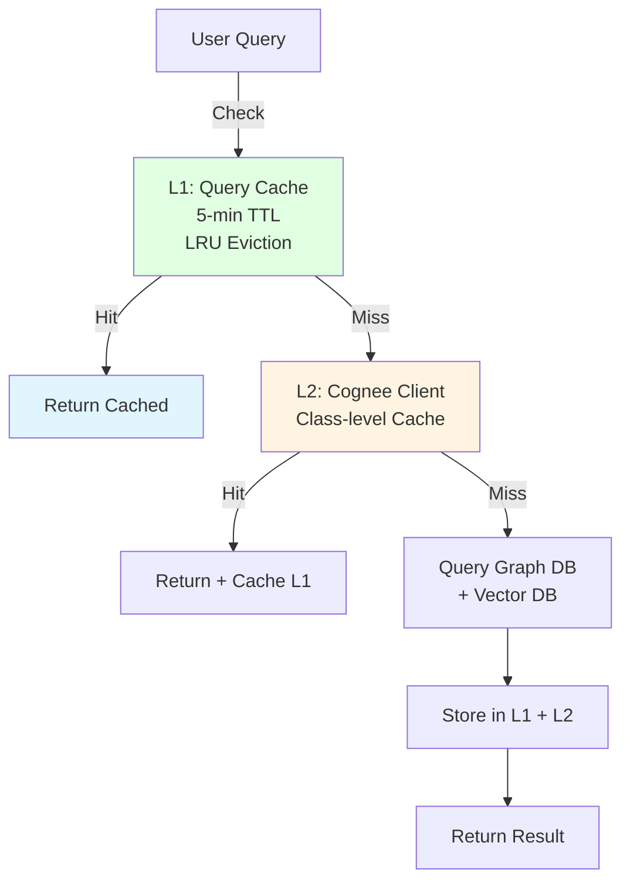

# Studio Pilot Vision - System Architecture

## Overview

Studio Pilot Vision is a comprehensive product portfolio command center providing AI-driven decision intelligence for managing products across their lifecycle.

## High-Level System Architecture

## Component Details

### 1. Frontend (React)

**Technology Stack:**
- React 18 + TypeScript
- Vite (build tool)
- Tailwind CSS + shadcn/ui
- TanStack React Query
- Recharts (visualization)

**Key Features:**
- Interactive product dashboards
- Portfolio health monitoring
- AI-powered insights interface
- Real-time data visualization

**Code Location:** `/src`

---

### 2. Data API (Go Backend)

**Technology Stack:**
- Go 1.21+
- Gin (HTTP framework)
- GORM (ORM)
- JWT authentication

**Responsibilities:**
- Product CRUD operations
- Portfolio management
- Governance actions tracking
- Authentication & authorization
- Real-time data serving

**Code Location:** `/backend`

**Key Endpoints:**
- `GET /api/products` - List products
- `GET /api/products/:id` - Product details
- `POST /api/governance-actions` - Create actions
- `GET /api/portfolio-health` - Portfolio metrics

---

### 3. AI Insights Service (Python)

**Technology Stack:**
- FastAPI
- Python 3.11+
- ChromaDB (vector store)
- Cognee (knowledge graph)
- sentence-transformers (embeddings)
- Groq API (LLM)

**Responsibilities:**
- Natural language query processing
- RAG-based retrieval
- Knowledge graph reasoning
- Confidence scoring
- Entity validation
- Document ingestion

**Code Location:** `/ai-insights`

**Architecture Type:** **Dual-Layer AI System**
- Layer 1: RAG Pipeline (fast retrieval)
- Layer 2: Cognee Knowledge Graph (persistent memory + reasoning)

---

### 4. Data Layer

#### Supabase PostgreSQL
- **Primary data store** for transactional operations
- **Tables:** products, portfolios, governance_actions, dependencies, risks, revenue_signals, etc.
- **Features:** Row-level security, real-time subscriptions, webhooks

#### ChromaDB (Vector Store)
- **Purpose:** Semantic search and RAG retrieval
- **Embedding Model:** sentence-transformers/all-MiniLM-L6-v2 (384 dimensions)
- **Collections:** product_documents, governance_documents, jira_documents

#### Neo4j/NetworkX (Knowledge Graph)
- **Purpose:** Persistent memory, causal reasoning, temporal tracking
- **Current:** NetworkX (in-memory, MVP)
- **Migration Target:** Neo4j (production-grade persistence)
- **Entity Types:** 10 types (Product, RiskSignal, GovernanceAction, etc.)
- **Relationship Types:** 9 types (HAS_RISK, TRIGGERS, RESULTS_IN, etc.)

---

## Deployment Architecture

**Deployment Details:**
- **Frontend:** Lovable (auto-deploy from GitHub, CDN-backed)
- **AI Service:** Render (Python, auto-scaling, 512MB-2GB RAM)
- **Database:** Supabase (managed PostgreSQL, automatic backups)
- **CI/CD:** GitHub integration with automatic deployments

---

## Security Architecture

**Security Features:**
- CORS protection with configured origins
- JWT-based authentication
- Row-level security in Supabase
- Input validation with Pydantic
- Environment variable management
- No hardcoded secrets

**Missing (To Add):**
- Rate limiting
- Security headers (CSP, HSTS)
- Audit logging
- Dependency scanning

---

## Scalability Considerations

### Current Capacity
- **Users:** 100-500 concurrent users
- **Products:** 1,000-5,000 products
- **AI Queries:** ~100 queries/minute

### Bottlenecks
1. **NetworkX (In-Memory):** No persistence, limited to single instance
2. **ChromaDB:** Single instance, no clustering
3. **No CDN:** Frontend assets served from origin

### Scaling Path

---

## Performance Characteristics

### Latency Targets (95th percentile)
- Product list page load: < 1s
- Product detail page load: < 500ms
- AI query (cached): < 50ms
- AI query (RAG): < 300ms
- AI query (Cognee): < 1s

### Current Performance
- Cache hit: < 1ms ✅
- RAG retrieval: ~100ms ✅
- Cognee query (CHUNKS): ~100ms ✅
- Cognee query (INSIGHTS): ~800ms ⚠️
- Full pipeline: ~200ms avg ✅

### Caching Strategy

---

## Monitoring & Observability

### Current Status
- ✅ Application logs (stdout)
- ✅ Performance metrics in code
- ✅ Health check endpoint
- ❌ Centralized logging
- ❌ Metrics collection (Prometheus)
- ❌ Distributed tracing
- ❌ Alerting

### Planned (See MONITORING.md)
- Prometheus metrics
- Grafana dashboards
- Alertmanager for alerts
- Structured logging with context
- Distributed tracing (Jaeger)

---

## Data Flow Patterns

See [DATA_FLOW.md](./DATA_FLOW.md) for detailed data flow diagrams.

## AI Architecture Details

See [AI_ARCHITECTURE.md](./AI_ARCHITECTURE.md) for detailed AI system architecture.

## Knowledge Graph Structure

See [COGNEE_KNOWLEDGE_GRAPH.md](./COGNEE_KNOWLEDGE_GRAPH.md) for Cognee entity and relationship details.

## Operational Guides

See [RUNBOOK.md](./RUNBOOK.md) for operational procedures and debugging guides.

---

## Architecture Decision Records (ADRs)

### ADR-001: Dual-Layer AI Architecture
**Decision:** Implement both RAG and Knowledge Graph layers
**Rationale:** RAG provides fast retrieval, Knowledge Graph provides reasoning and memory
**Trade-offs:** Increased complexity, but better quality and explainability

### ADR-002: Separate Go and Python Services
**Decision:** Go for data API, Python for AI
**Rationale:** Go excels at CRUD, Python has better AI ecosystem
**Trade-offs:** More deployment complexity, but better performance per service

### ADR-003: Supabase Over Self-Hosted PostgreSQL
**Decision:** Use managed Supabase
**Rationale:** Faster development, built-in auth, real-time, webhooks
**Trade-offs:** Vendor lock-in, but significant time savings

### ADR-004: NetworkX → Neo4j Migration Path
**Decision:** Start with NetworkX, migrate to Neo4j
**Rationale:** Faster MVP with NetworkX, production needs persistence
**Trade-offs:** Migration work later, but validates concept first

### ADR-005: Groq Over OpenAI
**Decision:** Use Groq with Llama 3.3 70B
**Rationale:** Faster inference (5-10x), lower cost, competitive quality
**Trade-offs:** Less mature API, but performance gains worth it

---

## Related Documentation

- [AI Architecture](./AI_ARCHITECTURE.md)
- [Data Flow Diagrams](./DATA_FLOW.md)
- [Cognee Knowledge Graph](./COGNEE_KNOWLEDGE_GRAPH.md)
- [Operational Runbook](./RUNBOOK.md)
- [API Documentation](./API_DOCS.md)
- [Monitoring Setup](./MONITORING.md)

---

**Last Updated:** 2026-01-04
**Version:** 1.0
**Status:** Active Development
