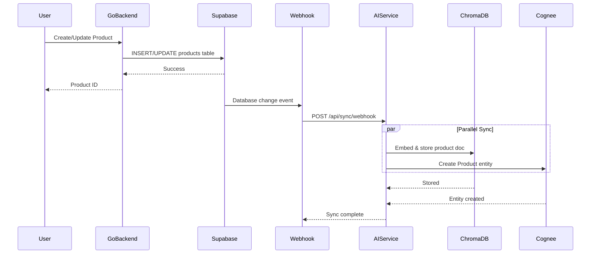
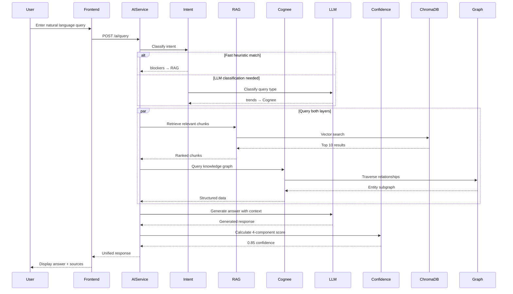
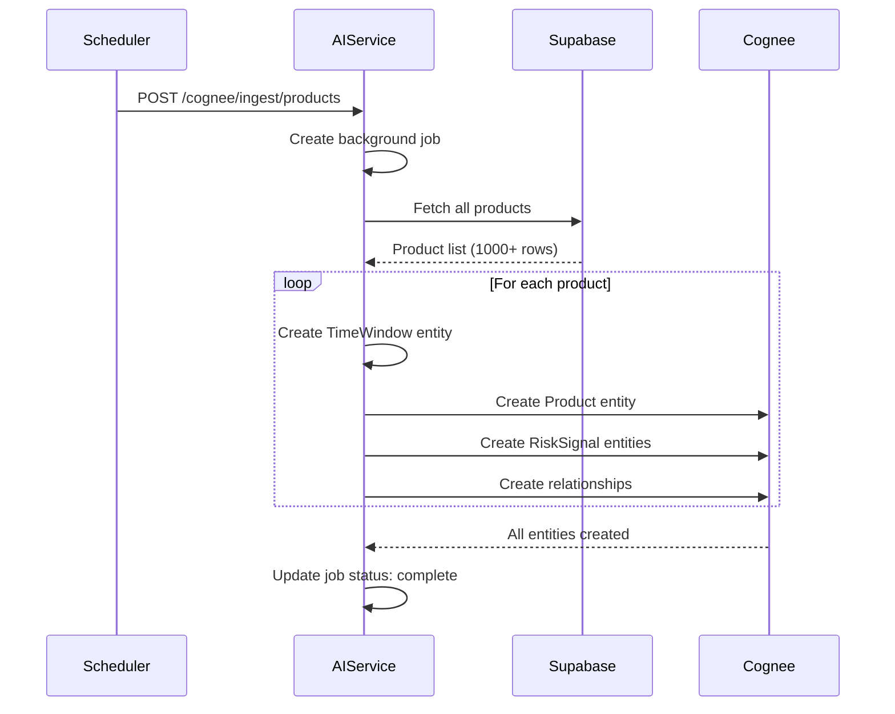
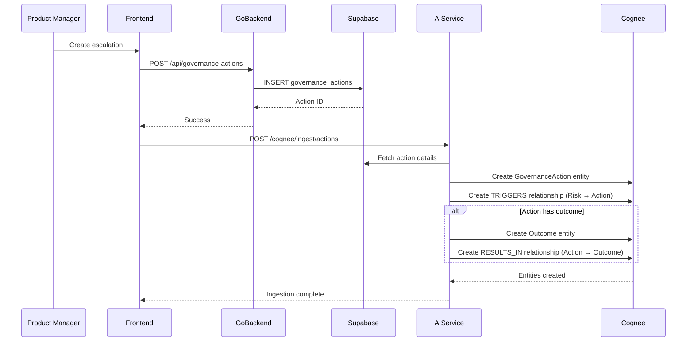
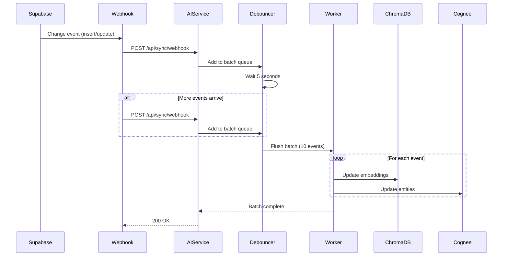
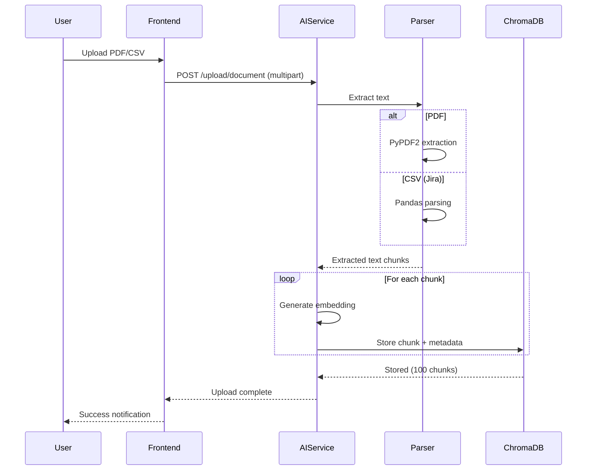
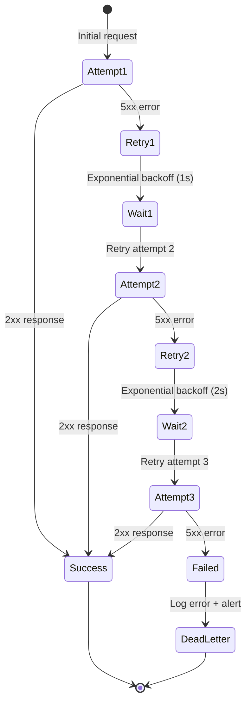

# Data Flow Architecture

## Overview

This document describes how data flows through Studio Pilot Vision, from ingestion to user-facing responses.

## 1. Product Data Ingestion Flow



### Flow Details

**Step 1: User Creates Product**
- User submits product form in React frontend
- Frontend calls Go backend: `POST /api/products`
- Go backend validates and saves to Supabase

**Step 2: Database Trigger**
- Supabase fires webhook on `products` table insert/update
- Webhook payload includes full row data

**Step 3: AI Service Sync**
- AI service receives webhook: `POST /api/sync/webhook`
- Debouncing applied (5-second window) to batch updates
- Parallel processing:
  - **ChromaDB:** Generate embedding, store in `product_documents` collection
  - **Cognee:** Create `Product` entity, create `HAS_RISK` relationships

**Step 4: Completion**
- AI service returns 200 OK
- System ready for queries on new product

### Data Transformation

**Supabase Row:**
```json
{
  "id": "550e8400-e29b-41d4-a716-446655440000",
  "name": "Mastercard Send",
  "lifecycle_stage": "Develop",
  "readiness_score": 75,
  "region": "North America",
  "revenue": 1200000
}
```

**ChromaDB Document:**
```json
{
  "id": "product_550e8400",
  "document": "Product: Mastercard Send. Stage: Develop. Readiness: 75%. Region: North America. Revenue: $1.2M",
  "metadata": {
    "product_id": "550e8400-e29b-41d4-a716-446655440000",
    "type": "product",
    "updated_at": "2025-01-04T10:30:00Z"
  },
  "embedding": [0.123, -0.456, ...]  // 384 dimensions
}
```

**Cognee Entity:**
```python
Product(
    product_id="550e8400-e29b-41d4-a716-446655440000",
    name="Mastercard Send",
    lifecycle_stage="Develop",
    region="North America",
    revenue=1200000,
    readiness_score=75
)
```

---

## 2. AI Query Flow



### Flow Details

**Step 1: Intent Classification (< 5ms)**

```python
# Fast heuristics (80% of queries)
if any(keyword in query.lower() for keyword in ["blocker", "block", "dependency"]):
    intent = "blockers"
    route = "rag_only"

elif any(keyword in query.lower() for keyword in ["why", "cause", "reason"]):
    intent = "causal"
    route = "cognee_only"

elif any(keyword in query.lower() for keyword in ["trend", "history", "over time"]):
    intent = "trends"
    route = "cognee_only"

else:
    # LLM classification (20% of queries, ~100ms)
    intent = llm_classify(query)
    route = intent_to_route[intent]
```

**Step 2: Parallel Retrieval (100-200ms)**

**RAG Path:**
1. Generate embedding for query (10-20ms)
2. Search ChromaDB (30-50ms)
3. Rerank results (10ms)
4. Format context (5ms)

**Cognee Path:**
1. Parse query entities (20ms)
2. Validate entity IDs (5ms, cached)
3. Traverse graph (50-100ms)
4. Format structured data (10ms)

**Step 3: LLM Generation (200-500ms)**

```python
prompt = f"""
Context from Vector Store:
{rag_chunks}

Context from Knowledge Graph:
Product: {product_name}
Risks: {risk_signals}
Recent Actions: {governance_actions}

User Question: {user_query}

Provide answer with sources.
"""

response = groq_client.generate(prompt, max_tokens=2048)
```

**Step 4: Confidence Scoring (5ms)**

```python
confidence = ConfidenceCalculator.calculate(
    freshness=calculate_freshness(last_updated),      # 0.9
    reliability=calculate_relationship_strength(entity),  # 0.85
    grounding=calculate_completeness(entity),         # 0.95
    coherence=calculate_historical_accuracy(intent)   # 0.75
)
# Overall: 0.7*0.9 + 0.3*0.85 + 0.2*0.95 + 0.25*0.75 = 0.85
```

**Step 5: Response Assembly**

```json
{
  "success": true,
  "answer": "Product X has 3 active blockers: Partner API delay (external), Resource constraint (internal), Security review pending (internal). The partner API delay is the most critical, affecting the Q1 launch date.",
  "confidence": 0.85,
  "confidence_breakdown": {
    "freshness": 0.9,
    "reliability": 0.85,
    "grounding": 0.95,
    "coherence": 0.75
  },
  "sources": [
    {"type": "Product", "id": "550e8400", "name": "Mastercard Send"},
    {"type": "Dependency", "id": "dep_123", "name": "Partner API Integration"}
  ],
  "reasoning_trace": [
    {"step": 1, "action": "Retrieved product from database"},
    {"step": 2, "action": "Found 3 dependencies marked as blockers"},
    {"step": 3, "action": "Ranked by severity: Partner API (critical), Resource (high), Security (medium)"}
  ],
  "source_type": "hybrid"
}
```

---

## 3. Weekly Batch Ingestion Flow



### Batch Processing Strategy

**Why Batch Ingestion?**
- Captures weekly snapshots for temporal analysis
- Avoids overwhelming real-time webhooks
- Allows for data quality checks before ingestion
- Creates consistent TimeWindow entities

**Schedule:**
- **Frequency:** Weekly (Sunday midnight UTC)
- **Duration:** ~5-10 minutes for 1000 products
- **Retry:** 3 attempts with exponential backoff

**Job Status Tracking:**
```python
@app.get("/cognee/ingest/status/{job_id}")
async def get_job_status(job_id: str):
    job = job_store.get(job_id)
    return {
        "job_id": job_id,
        "status": job.status,  # "pending", "running", "completed", "failed"
        "progress": job.progress_percent,
        "total_items": job.total,
        "processed_items": job.processed,
        "error": job.error if job.status == "failed" else None
    }
```

---

## 4. Governance Action Flow



### Causal Chain Building

**Example: Risk Detection → Action → Outcome**

1. **Risk Detected (Jan 1):**
```python
RiskSignal(
    signal_id="risk_001",
    product_id="550e8400",
    risk_type="Readiness",
    severity="High",
    risk_band="Yellow",
    detected_at="2025-01-01T09:00:00Z"
)
```

2. **Action Taken (Jan 2):**
```python
GovernanceAction(
    action_id="action_001",
    action_type="Escalation",
    owner="VP Product",
    created_at="2025-01-02T10:00:00Z"
)

# Relationship: risk_001 -[TRIGGERS]-> action_001
```

3. **Outcome Recorded (Jan 5):**
```python
Outcome(
    outcome_id="outcome_001",
    result_type="Resources Allocated",
    successful=True,
    impact_description="Added 2 engineers to team",
    completed_at="2025-01-05T14:00:00Z"
)

# Relationship: action_001 -[RESULTS_IN]-> outcome_001
```

4. **Graph Query:**
```cypher
MATCH path = (r:RiskSignal)-[:TRIGGERS]->(a:GovernanceAction)
             -[:RESULTS_IN]->(o:Outcome)
WHERE r.signal_id = 'risk_001'
RETURN path
```

**AI Response:**
> "The Yellow risk on Jan 1st (readiness score drop) was escalated to VP Product on Jan 2nd, resulting in 2 additional engineers allocated on Jan 5th. This action successfully addressed the risk."

---

## 5. Real-Time Webhook Sync Flow



### Debouncing Strategy

**Problem:** Rapid updates cause duplicate syncs, wasting resources

**Solution:** 5-second debounce window
```python
class WebhookDebouncer:
    def __init__(self, window_seconds=5):
        self.window = window_seconds
        self.pending = {}  # product_id -> latest_event

    async def add_event(self, product_id: str, event: dict):
        # Replace any pending event for same product
        self.pending[product_id] = event

        # Schedule flush after window
        await asyncio.sleep(self.window)
        await self.flush_batch()

    async def flush_batch(self):
        events = list(self.pending.values())
        self.pending.clear()

        # Process batch in parallel
        await asyncio.gather(*[sync_to_ai(event) for event in events])
```

**Benefits:**
- Reduces sync calls by 70-80% during bulk updates
- Prevents Cognee duplicate errors
- Lower API costs
- Better performance

---

## 6. Document Upload Flow



### Chunking Strategy

**Goal:** Balance context size vs. retrieval precision

**Configuration:**
```python
CHUNK_CONFIG = {
    "size": 500,           # tokens per chunk
    "overlap": 50,         # token overlap between chunks
    "separator": "\n\n"    # prefer semantic boundaries
}
```

**Example:**

**Original Document (1500 tokens):**
```
Mastercard Send is a product in the Develop stage...
[500 tokens]
...dependencies include Partner API integration...
[500 tokens]
...risks identified: resource constraint, timeline pressure...
[500 tokens]
```

**Chunked:**
- Chunk 1: Tokens 0-500 (product description)
- Chunk 2: Tokens 450-950 (overlap 50, dependencies)
- Chunk 3: Tokens 900-1400 (overlap 50, risks)

**Metadata:**
```json
{
  "source": "product_spec_v2.pdf",
  "chunk_id": 1,
  "total_chunks": 3,
  "page": 1,
  "uploaded_at": "2025-01-04T10:30:00Z"
}
```

---

## 7. Error Handling & Retry Flow



### Retry Policy

**Transient Errors (Retry):**
- 500 Internal Server Error
- 503 Service Unavailable
- Network timeouts
- Database connection errors

**Permanent Errors (No Retry):**
- 400 Bad Request (invalid input)
- 401 Unauthorized
- 404 Not Found
- 422 Validation Error

**Retry Configuration:**
```python
RETRY_CONFIG = {
    "max_attempts": 3,
    "initial_delay": 1.0,    # seconds
    "backoff_factor": 2.0,   # exponential
    "max_delay": 10.0,       # cap at 10 seconds
    "jitter": True           # add randomness
}
```

**Implementation:**
```python
@retry(
    stop=stop_after_attempt(3),
    wait=wait_exponential(multiplier=1, min=1, max=10),
    retry=retry_if_exception_type((ConnectionError, Timeout))
)
async def sync_to_cognee(data: dict):
    response = await cognee_client.add_data(data)
    return response
```

---

## Data Flow Metrics

### Performance Targets (95th percentile)

| Flow | Target | Current | Status |
|------|--------|---------|--------|
| Product creation → Supabase | < 200ms | 150ms | ✅ |
| Webhook → AI sync | < 2s | 1.5s | ✅ |
| AI query (cached) | < 50ms | 10ms | ✅ |
| AI query (RAG) | < 300ms | 150ms | ✅ |
| AI query (Cognee) | < 1s | 800ms | ⚠️ |
| Batch ingestion (1K products) | < 10min | 8min | ✅ |
| Document upload (10MB PDF) | < 30s | 25s | ✅ |

### Throughput Targets

| Operation | Target | Current | Status |
|-----------|--------|---------|--------|
| Product creates/sec | 10 | 15 | ✅ |
| AI queries/sec | 20 | 12 | ✅ |
| Webhook events/sec | 50 | 30 | ✅ |
| Concurrent users | 100 | 50 | ✅ |

---

## Related Documentation

- [System Architecture](./ARCHITECTURE.md)
- [AI Architecture](./AI_ARCHITECTURE.md)
- [API Documentation](./API_DOCS.md)
- [Operational Runbook](./RUNBOOK.md)

---

**Last Updated:** 2026-01-04
**Version:** 1.0
