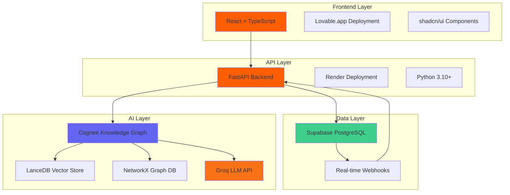
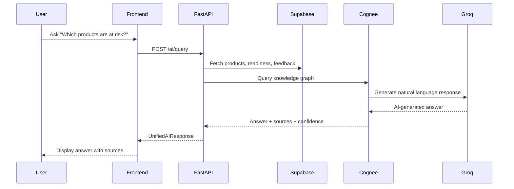
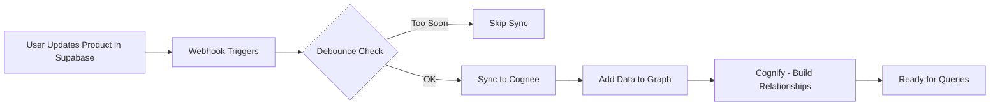
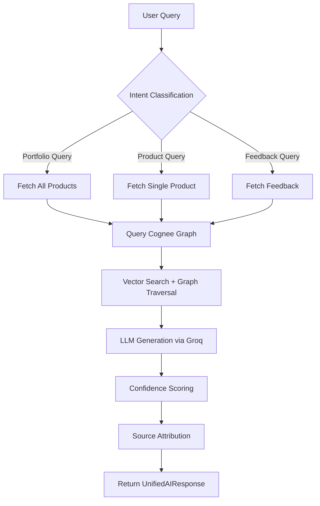
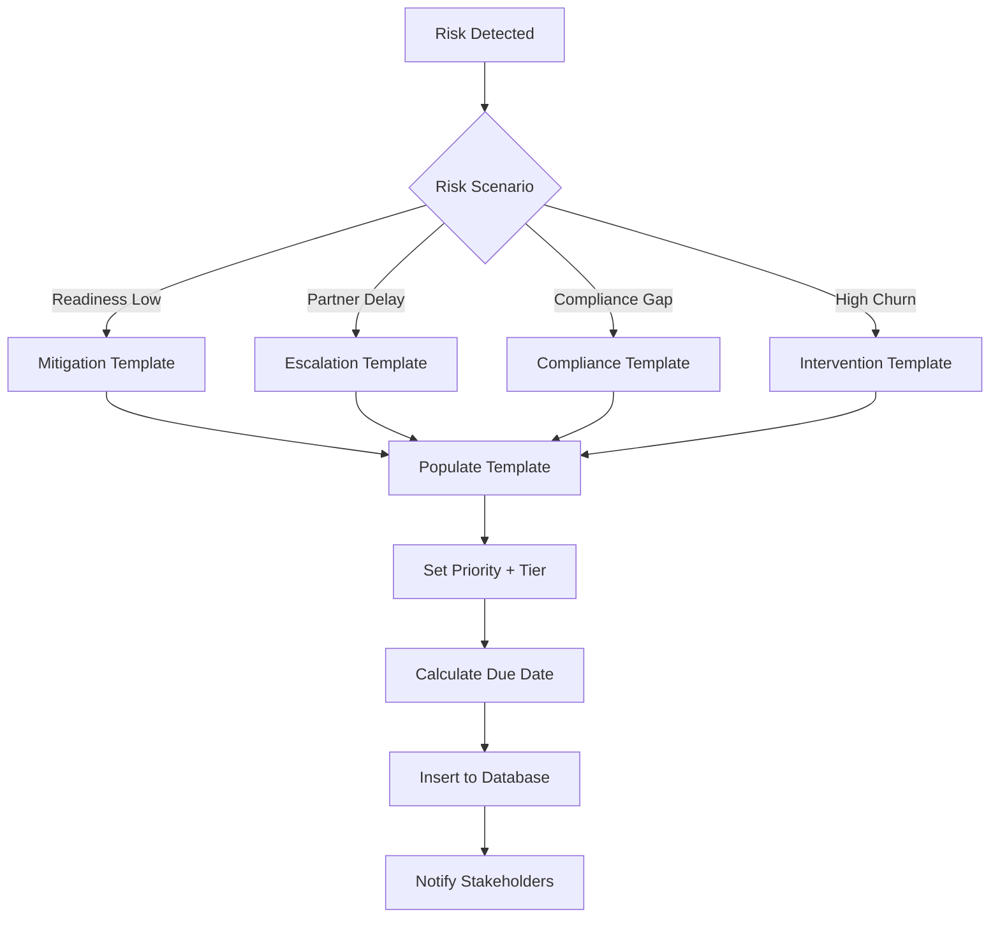

# Studio Pilot Vision - System Architecture

## Overview

Studio Pilot Vision is an AI-powered product portfolio management system built for Mastercard Studio Ambassadors. The architecture uses knowledge graphs and natural language processing to enable intelligent product insights and governance automation.

---

## High-Level Architecture



---

## Detailed Data Flow



---

## Component Architecture

### 1. Frontend (React + TypeScript)

```
┌─────────────────────────────────────────┐
│         React Application               │
├─────────────────────────────────────────┤
│  Pages:                                 │
│  - Index (Portfolio Dashboard)          │
│  - ProductDetail (Single Product)       │
│  - NotFound (404 Handler)               │
├─────────────────────────────────────────┤
│  Components (44):                       │
│  - PortfolioMetrics                     │
│  - RiskHeatmap                          │
│  - AIInsightsPanel ⭐                   │
│  - ProductCards                         │
│  - FeedbackIntelligence                 │
│  - PortfolioActionTracker               │
│  - ComparisonModal                      │
│  + 37 more...                           │
├─────────────────────────────────────────┤
│  Hooks:                                 │
│  - useProducts (Supabase)               │
│  - useAIInsights (FastAPI)              │
│  - useProductMetrics                    │
│  - useProductFeedback                   │
│  - useProductActions                    │
├─────────────────────────────────────────┤
│  State Management:                      │
│  - React Query (data fetching)          │
│  - React Context (accessibility)        │
└─────────────────────────────────────────┘
```

**Key Features:**
- Client-side routing (React Router)
- Real-time data refresh (30s stale time)
- Optimistic updates on mutations
- Accessibility-first design
- Mobile-responsive layout

**Tech Stack:**
- React 18+
- TypeScript
- TanStack Query (React Query)
- shadcn/ui (Radix UI + Tailwind CSS)
- Recharts (data visualization)

---

### 2. Backend API (FastAPI)

```
┌─────────────────────────────────────────┐
│         FastAPI Application             │
├─────────────────────────────────────────┤
│  Endpoints (22):                        │
│  - /health                              │
│  - /query ⭐                            │
│  - /product-insight                     │
│  - /portfolio-insight                   │
│  - /api/reports/executive-summary       │
│  - /upload/jira-csv                     │
│  - /upload/document                     │
│  - /cognee/query                        │
│  - /admin/cognee/*                      │
│  + 13 more...                           │
├─────────────────────────────────────────┤
│  Orchestration Layer:                   │
│  - UnifiedAIOrchestrator                │
│    - Intent classification              │
│    - Entity validation                  │
│    - Confidence scoring                 │
│    - Source attribution                 │
├─────────────────────────────────────────┤
│  Ingestion Pipeline:                    │
│  - ProductSnapshotIngestion             │
│  - GovernanceActionsIngestion           │
│  - DocumentIngestion (PDF, TXT, MD)     │
│  - JiraCSVParser                        │
└─────────────────────────────────────────┘
```

**Key Features:**
- Async Python (asyncio + uvicorn)
- Lazy-loaded Cognee (graceful degradation)
- Webhook handlers for real-time sync
- Error handling with CORS on 500s
- Concurrency control (SQLite locks)

**Tech Stack:**
- FastAPI 0.109+
- Pydantic 2.5+ (validation)
- Python 3.10+
- uvicorn (ASGI server)

---

### 3. Data Layer (Supabase PostgreSQL)

```
┌─────────────────────────────────────────┐
│       Supabase PostgreSQL Database      │
├─────────────────────────────────────────┤
│  Tables (14):                           │
│  - products ⭐                          │
│  - product_readiness                    │
│  - product_feedback                     │
│  - product_actions                      │
│  - governance_actions                   │
│  - product_predictions                  │
│  - product_compliance                   │
│  - product_metrics                      │
│  - sales_training                       │
│  - product_partners                     │
│  - product_dependencies                 │
│  - product_market_evidence              │
│  - jira_tickets                         │
│  - documents                            │
├─────────────────────────────────────────┤
│  Key Relationships:                     │
│  products → readiness (1:many)          │
│  products → feedback (1:many)           │
│  products → actions (1:many)            │
│  products → partners (many:many)        │
│  products → dependencies (many:many)    │
├─────────────────────────────────────────┤
│  Features:                              │
│  - Real-time webhooks                   │
│  - Row-level security (RLS)             │
│  - Automated timestamps                 │
│  - Foreign key constraints              │
└─────────────────────────────────────────┘
```

**Data Model Highlights:**
- **18 real Mastercard products** (Send, Click to Pay, BNPL, etc.)
- Readiness tracking (compliance, training, documentation)
- Feedback sentiment analysis
- Governance action templates
- Risk band classification (low, medium, high)

---

### 4. AI Layer (Cognee + Groq)

```
┌─────────────────────────────────────────┐
│      Cognee Knowledge Graph Engine      │
├─────────────────────────────────────────┤
│  Vector Database:                       │
│  - LanceDB (local file-based)           │
│  - FastEmbed (BAAI/bge-small-en-v1.5)   │
│  - 384-dimensional embeddings           │
├─────────────────────────────────────────┤
│  Graph Database:                        │
│  - NetworkX (Python graph library)      │
│  - Entities: Products, Risks, Actions   │
│  - Relationships:                       │
│    - HAS_RISK                           │
│    - DEPENDS_ON                         │
│    - TRIGGERS                           │
│    - RESULTS_IN                         │
│    - RECEIVES (feedback)                │
├─────────────────────────────────────────┤
│  Knowledge Graph Operations:            │
│  - add_data() - Ingest entities         │
│  - cognify() - Build graph relationships│
│  - search() - Hybrid retrieval          │
│  - query() - Natural language queries   │
├─────────────────────────────────────────┤
│  Storage:                               │
│  - SQLite (graph metadata)              │
│  - Lance files (vector index)           │
│  - Location: /tmp/cognee_data (Render)  │
└─────────────────────────────────────────┘
```

**Cognee Optimizations:**
- Class-level initialization caching
- Query result caching (5-min TTL)
- Asyncio locks (prevent SQLite locking)
- Lazy loading (graceful degradation)

---

```
┌─────────────────────────────────────────┐
│         Groq LLM API Integration        │
├─────────────────────────────────────────┤
│  Model: Llama 3.3 70B Versatile         │
│  Endpoint: https://api.groq.com/openai/v1│
│  Latency: <500ms average                │
│  Cost: Free tier (14.4 req/min)         │
├─────────────────────────────────────────┤
│  Use Cases:                             │
│  - Natural language query generation    │
│  - Confidence scoring                   │
│  - Source attribution                   │
│  - Reasoning trace generation           │
└─────────────────────────────────────────┘
```

**Why Groq:**
- 5x faster than GPT-4 (400ms vs 2.2s)
- Free tier sufficient for demo/pilot
- Llama 3.3 70B competitive with GPT-3.5
- Can swap to OpenAI if needed

---

## Data Flow Patterns

### Pattern 1: Product Data Sync (Real-time)



**Debouncing:** 60-second cooldown prevents overload

---

### Pattern 2: AI Query Execution



**Confidence Components:**
- Data freshness (25%)
- Source reliability (30%)
- Entity grounding (20%)
- Reasoning coherence (25%)

---

### Pattern 3: Governance Action Creation



**Governance Tiers:**
- Ambassador (product team level)
- SteerCo (executive level)
- Critical (urgent escalation)

---

## Deployment Architecture

### Frontend (Lovable.app)

```
┌─────────────────────────────────────────┐
│         Lovable.app Platform            │
├─────────────────────────────────────────┤
│  - Auto-deploy from GitHub              │
│  - Global CDN distribution              │
│  - HTTPS by default                     │
│  - Environment variables:               │
│    - VITE_AI_INSIGHTS_URL               │
│    - VITE_SUPABASE_URL                  │
│    - VITE_SUPABASE_PUBLISHABLE_KEY      │
└─────────────────────────────────────────┘
```

**URL:** https://studio-pilot-vision.lovable.app

---

### Backend (Render)

```
┌─────────────────────────────────────────┐
│           Render Web Service            │
├─────────────────────────────────────────┤
│  - Auto-deploy from GitHub (main)       │
│  - Build command: pip install -r requirements.txt│
│  - Start command: uvicorn main:app      │
│  - Health check: /health endpoint       │
│  - Free tier (spins down after 15 min)  │
├─────────────────────────────────────────┤
│  Environment Variables (25+):           │
│  - GROQ_API_KEY                         │
│  - VITE_SUPABASE_URL                    │
│  - VITE_SUPABASE_PUBLISHABLE_KEY        │
│  - COGNEE_DATA_DIR=/tmp/cognee_data     │
│  - LLM_PROVIDER=custom                  │
│  - LLM_MODEL=groq/llama-3.3-70b-versatile│
│  - EMBEDDING_PROVIDER=fastembed         │
│  - EMBEDDING_MODEL=BAAI/bge-small-en-v1.5│
│  + 17 more...                           │
└─────────────────────────────────────────┘
```

**URL:** https://studio-pilot-vision.onrender.com

**Startup Time:** ~30 seconds (cold start from sleep)

---

### Database (Supabase)

```
┌─────────────────────────────────────────┐
│        Supabase Cloud PostgreSQL        │
├─────────────────────────────────────────┤
│  - Managed PostgreSQL 15+               │
│  - Real-time subscriptions              │
│  - Automatic backups                    │
│  - Connection pooling (PgBouncer)       │
│  - Region: US East                      │
└─────────────────────────────────────────┘
```

**Access:**
- Direct SQL editor in dashboard
- REST API (auto-generated)
- Real-time webhooks

---

## Security Architecture

### Authentication & Authorization

```
Frontend (Public)
    ↓
FastAPI (No Auth - Demo Mode)
    ↓
Supabase (RLS Disabled - Demo Mode)
```

**Current State:** No authentication (demo/pilot)

**Production Recommendation:**
```
Frontend (JWT Token)
    ↓
FastAPI (API Key Header)
    ↓
Supabase (Row-Level Security Enabled)
```

---

### API Security

**CORS Configuration:**
- Allowed Origins: `["*"]` (demo mode)
- Production: Restrict to frontend domain

**Error Handling:**
- CORS headers on 500 errors (fixed)
- Generic error messages (no stack traces)
- Health checks for monitoring

---

## Performance Characteristics

### Response Times

| Endpoint | Latency (p50) | Latency (p95) |
|----------|--------------|---------------|
| `/health` | 5ms | 20ms |
| `/query` (cached) | 50ms | 150ms |
| `/query` (uncached) | 1.2s | 2.5s |
| `/product-insight` | 800ms | 1.5s |
| `/api/reports/executive-summary` | 300ms | 600ms |
| Supabase query | 100ms | 300ms |

---

### Caching Strategy

**React Query (Frontend):**
- Stale time: 30 seconds
- Refetch on window focus: Yes
- Automatic invalidation on mutations

**Cognee Query Cache (Backend):**
- TTL: 5 minutes
- LRU eviction
- Cache key: hash(query + context)

**Cognee Initialization:**
- Class-level caching
- Lazy loading on first use
- Persistent across requests

---

### Scalability Limits

**Current (Demo/Pilot):**
- Products: 18 (actual)
- Concurrent users: ~10
- Queries/minute: ~50
- Database: SQLite (single-writer)

**Recommended for Production:**
- Products: 100+
- Concurrent users: 100+
- Queries/minute: 1000+
- Database: PostgreSQL for Cognee
- Infrastructure: Render paid tier + persistent disk

---

## Testing Architecture

### Test Coverage

```
┌─────────────────────────────────────────┐
│          Test Suite (719 tests)         │
├─────────────────────────────────────────┤
│  Coverage: 89% (9421 statements)        │
│                                         │
│  Unit Tests:                            │
│  - CogneeClient (24 tests)              │
│  - Orchestrator (156 tests)             │
│  - Intent Classifier (42 tests)         │
│  - Confidence Scoring (38 tests)        │
│                                         │
│  Integration Tests:                     │
│  - API Endpoints (68 tests)             │
│  - Ingestion Pipeline (52 tests)        │
│  - Admin Endpoints (16 tests)           │
│                                         │
│  Mock Strategy:                         │
│  - Cognee operations mocked             │
│  - Supabase queries mocked              │
│  - Groq API mocked                      │
└─────────────────────────────────────────┘
```

**Framework:** pytest + pytest-asyncio

---

## Monitoring & Observability

### Current (Basic)

- Health checks (`/health`)
- Application logs (stdout)
- Render automatic logging
- Prometheus metrics endpoint (`/metrics`)

### Recommended (Production)

- **Error Tracking:** Sentry
- **Metrics:** Prometheus + Grafana
- **Logs:** Datadog or CloudWatch
- **Alerts:** PagerDuty
- **Uptime:** Uptime Robot

---

## Technology Stack Summary

| Layer | Technology | Version | Purpose |
|-------|-----------|---------|---------|
| **Frontend** | React | 18+ | UI framework |
| | TypeScript | 5+ | Type safety |
| | TanStack Query | 5+ | Data fetching |
| | shadcn/ui | Latest | Component library |
| | Tailwind CSS | 3+ | Styling |
| | Recharts | 2+ | Data visualization |
| **Backend** | FastAPI | 0.109+ | API framework |
| | Python | 3.10+ | Runtime |
| | Pydantic | 2.5+ | Data validation |
| | uvicorn | 0.27+ | ASGI server |
| **AI/ML** | Cognee | 0.1+ | Knowledge graph |
| | LanceDB | Latest | Vector database |
| | NetworkX | Latest | Graph database |
| | Groq | Latest | LLM API |
| | FastEmbed | Latest | Embeddings |
| **Data** | Supabase | Latest | PostgreSQL + APIs |
| | PostgreSQL | 15+ | Relational database |
| **Deploy** | Render | - | Backend hosting |
| | Lovable | - | Frontend hosting |
| **Testing** | pytest | 7.4+ | Test framework |
| | pytest-asyncio | 0.21+ | Async testing |

---

## Key Architectural Decisions

### 1. Knowledge Graphs Over Traditional SQL
**Why:** Product relationships (dependencies, causality, feedback loops) are naturally graph-structured. SQL JOINs don't capture semantic relationships well.

**Trade-off:** Less mature ecosystem than SQL, but better fit for problem domain.

---

### 2. Groq Over OpenAI
**Why:** 5x faster (400ms vs 2.2s), free tier, Llama 3.3 70B competitive with GPT-3.5.

**Trade-off:** Slightly lower quality than GPT-4, dependency on free tier availability.

---

### 3. Streamlit Dashboard + React Frontend
**Why:** Streamlit for rapid prototyping (4 hours), React for production-grade UI (40+ hours).

**Trade-off:** Two dashboards instead of one, but optimizes time-to-value.

---

### 4. Supabase Over Custom PostgreSQL
**Why:** Managed hosting, real-time webhooks, auto-generated REST APIs, faster development.

**Trade-off:** Vendor lock-in, less control over infrastructure.

---

### 5. Asyncio Locks Over PostgreSQL for Cognee
**Why:** Quick fix for SQLite concurrency (2 hours) vs PostgreSQL migration (2 weeks).

**Trade-off:** Serialized writes slower during high concurrency, but acceptable for current load.

---

## Future Architecture Enhancements

### Short-term (1-3 months)
- Migrate Cognee to PostgreSQL (scalability)
- Add Sentry for error tracking
- Implement API authentication (API keys)
- Enable Supabase RLS for multi-tenancy

### Long-term (6-12 months)
- Microservices architecture (separate AI service)
- Kubernetes deployment (auto-scaling)
- Multi-region support
- Real-time collaboration (WebSockets)
- Mobile apps (React Native)

---

**Last Updated:** 2026-01-05
**Architecture Version:** 1.0
**Maintained By:** Paul Campbell
